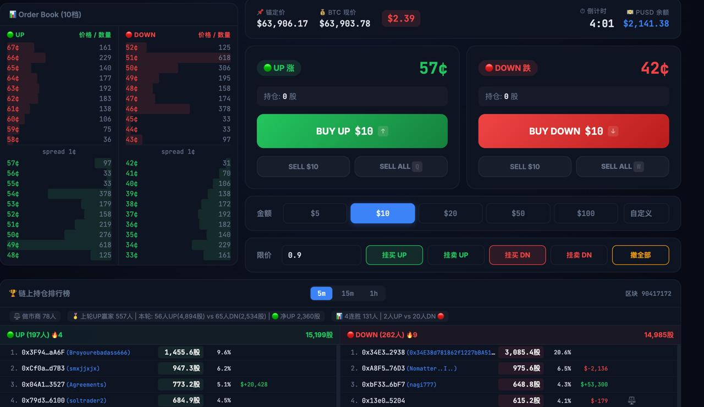

# Polymarket Quick Trade & Onchain Leaderboard

一个支持 Polymarket 多市场的快捷交易面板，并集成实时的链上盈亏与大户交易排名榜单。



## 注意事项

> ⚠️ **永远不要将 `.env` 文件提交到 Git！** 里面包含你的私钥。项目已配置 `.gitignore` 自动忽略该文件。

> 💡 **作者寄语**：
> 这是一个我自己平时高频使用的自用工具，目前运行非常稳定。如果大家在安装或使用过程中遇到任何报错或问题，**建议先直接把错误代码发给 ChatGPT/Claude 等 AI 助手排查**。因为项目是完全开源的，所以你可以自由地修改、增加或删除任何你不需要的功能。祝大家交易顺利！

## 特性
- ⚡️ **单键快速下单**: 支持通过键盘快捷键快速进行买入/卖出
- 📊 **多时间维度市场**: 支持快速切换 BTC/ETH 的 5分钟、15分钟、1小时市场
- 🏆 **链上大户排行榜**: 实时抓取链上订单数据，统计交易排名 Top 100
- 🔄 **多账号切换**: 支持配置多个交易账号并在面板中一键切换

## 关于“净持仓”排名原理

很多数据接口（如 Polymarket Data API）只能看到作为 Taker 的交易量。本工具通过直接扫描 Polygon 链上 CTF 合约的 `TransferSingle` 事件，能够精准捕获 `Maker下单`、`Taker吃单` 甚至 `直接钱包转账` 行为，从而为你还原**最真实、无死角的净持仓排名**。

## 环境要求

- **Python >= 3.10**
- **Alchemy API Key** (用于 Polygon RPC 读取链上数据)
- **Polymarket 交易钱包私钥** (用于下单交易)

## 安装步骤

1. 克隆本仓库到本地：
```bash
git clone https://github.com/JamesLHW/polymarket-quick-trade.git
cd polymarket-quick-trade
```

2. 安装依赖包：
```bash
pip install -r requirements.txt
```

3. 复制配置模板并填写配置：
```bash
cp .env.template .env
```
   - 在 `.env` 里填入你的 `ALCHEMY_KEY`（可在 [alchemy.com](https://www.alchemy.com/) 免费申请）
   - 填入你的 Polymarket 交易钱包私钥 `QUICK_PRIVATE_KEY` 与对应的地址 `QUICK_FUNDER`

## 运行方法

```bash
python onchain_leaderboard.py
```

启动后终端会提示：
```text
  ⚡ Quick Trade: http://localhost:8890
```

使用浏览器打开 `http://localhost:8890` 即可使用快速交易面板和查看实时链上榜单。

## 快捷键

| 按键 | 功能 |
|------|------|
| `↑` | 买入 UP |
| `↓` | 买入 DOWN |
| `Q` | 卖出全部 UP |
| `W` | 卖出全部 DOWN |
| `1`~`5` | 选择金额 ($5 / $10 / $20 / $50 / $100) |

## 界面图标说明

在终端的排行榜中，你会看到一些特殊图标（Emoji），它们的含义如下：

- 🥇 🥈 🥉：当前回合净持仓数量排名前三名
- 🐋 **鲸鱼 (Whale)**：当你将特定地址加入 `tracked_whales_list.txt` 后，该地址会上榜并显示此图标，同时会实时拉取显示该地址的 Polymarket 用户名及历史总盈亏（PnL）。
- ⚖️ **天平 (Maker/Hedged)**：代表该地址在当前回合双向持仓（可能在做市、或者进行了对冲操作）。
- 🔥 **连胜冒火 (Hot Streak)**：代表该地址在最近的连续几个回合中持续盈利（基于底层 `持仓/` 目录的连胜历史数据追踪）。

## 高级功能与数据缓存

- **追踪特定大户 (`tracked_whales_list.txt`)**：你可以把感兴趣的 Polygon 钱包地址（0x开头）一行一个粘贴到该文件中。**程序支持热重载**，修改文件保存后，下一个 5 分钟回合就会自动生效，无需重启脚本。
- **用户名缓存 (`username_cache.json`)**：程序会自动将链上地址对应的 Polymarket 昵称缓存到该文件，避免频繁请求 Polymarket 接口导致被封 IP。
- **历史记录存档 (`持仓/` 目录)**：每回合结束时，程序会自动将完整的持仓排名和具体的**买入区块信息**保存为 CSV 文件。你可以利用这些 CSV 数据进行二次聚类分析（比如排查多账号女巫攻击或跟随大户建仓时间点）。

## 其他命令

```bash
# 只查询一次当前回合排名（不进入实时监控）
python onchain_leaderboard.py --once

# 指定回合时间戳查询历史排名
python onchain_leaderboard.py --ts 1775757000
```


